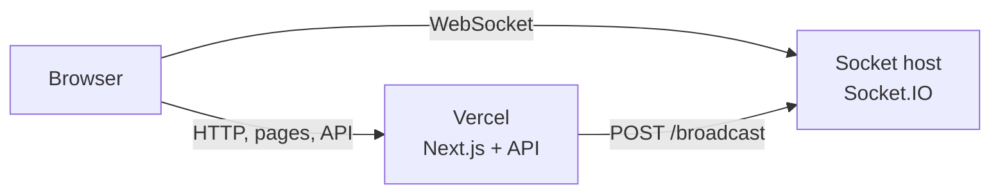

# Deployment (Vercel + Socket server)

This guide describes how to deploy the Housie app to production: the **Next.js app** on **Vercel** and the **Socket.IO server** on a separate host that supports WebSockets.

## Overview and architecture

The app uses two parts:

1. **Next.js (Vercel)** – pages, API routes, and in-memory room store. The API calls the socket server to broadcast room updates.
2. **Socket server (Railway / Render / etc.)** – long-lived Node process with Socket.IO. Browsers connect here for real-time updates; the API POSTs to `/broadcast` to push room state.

Vercel is serverless and does **not** support persistent WebSocket servers. So the Socket.IO server must run on a different platform that allows long-lived Node processes and WebSockets.

## 1. Deploy Next.js (project) to Vercel

### Prerequisites

- Vercel account ([vercel.com](https://vercel.com))
- Repository connected (GitHub, GitLab, or Bitbucket)

### Steps

1. In Vercel, click **Add New** → **Project** and import your repository.
2. Framework Preset: **Next.js**. Root Directory: leave default (repository root).
3. Build command: leave default (`next build`). Output directory: leave default.
4. Do **not** set environment variables yet (you need the socket server URL first). You can deploy once, then add env vars and redeploy after deploying the socket server.

### Environment variables (Vercel)

Set these in **Project → Settings → Environment Variables** for **Production** (and Preview if you use it):

| Variable                 | Value                                                                     | Used by                                                                                   |
| ------------------------ | ------------------------------------------------------------------------- | ----------------------------------------------------------------------------------------- |
| `NEXT_PUBLIC_SOCKET_URL` | Full URL of the socket server (e.g. `https://your-socket.up.railway.app`) | Browser – connects to Socket.IO ([app/room/[code]/page.tsx](../app/room/[code]/page.tsx)) |
| `SOCKET_SERVER_URL`      | Same URL as above                                                         | Server – API POSTs to `/broadcast` ([lib/rooms.ts](../lib/rooms.ts))                      |

Use **https** in production. Do **not** add a trailing slash.

You do **not** set `SOCKET_PORT` on Vercel; that is only for the socket server host.

---

## 2. Deploy Socket server

The socket server is a single Node script: [scripts/socket-server.js](../scripts/socket-server.js). It uses:

- `SOCKET_PORT` – port to listen on (default 3001). The host usually assigns the public URL.
- `CORS_ORIGIN` – allowed origin for Socket.IO (e.g. your Vercel app URL). Set this in production instead of `*`.

It exposes Socket.IO (WebSocket) and `POST /broadcast` for the API.

### Option A – Railway

1. Go to [railway.app](https://railway.app) and create a new project.
2. **Deploy from GitHub repo** (or push your repo and connect it). Root directory = repo root.
3. **Settings** for the service:
   - **Build**: No build command needed for plain Node. Ensure dependencies are installed (e.g. Railway runs `npm install` by default if `package.json` exists).
   - **Start command**: `node scripts/socket-server.js`
4. **Variables** (Railway dashboard or `railway.toml`):
   - `SOCKET_PORT` = `3001` (or leave unset to use default 3001)
   - `CORS_ORIGIN` = your Vercel app URL (e.g. `https://your-app.vercel.app`)
5. **Deploy**. Railway assigns a public URL (e.g. `https://your-project.up.railway.app`). Copy this URL for the Vercel env vars above.

### Option B – Render

1. Go to [render.com](https://render.com) and create a **Web Service**.
2. Connect your repository. Root directory = repo root.
3. **Runtime**: Node.
4. **Build command**: leave empty or `npm install`.
5. **Start command**: `node scripts/socket-server.js`
6. **Environment**:
   - `SOCKET_PORT` = `3001` (if required by Render; some runtimes use `PORT` – check Render docs)
   - `CORS_ORIGIN` = your Vercel app URL (e.g. `https://your-app.vercel.app`)
7. Deploy. Use the Render-assigned URL (e.g. `https://your-service.onrender.com`) for `NEXT_PUBLIC_SOCKET_URL` and `SOCKET_SERVER_URL` on Vercel.

### Other hosts

You can run the same script on Fly.io, a small VPS, or any Node host that allows long-lived processes and WebSockets. Set `SOCKET_PORT` and `CORS_ORIGIN` as above and use the public URL in Vercel.

---

## 3. Wire the two deployments

1. **Deploy the socket server first** (Railway or Render). Copy its **public URL** (e.g. `https://housie-socket.up.railway.app`).
2. In **Vercel** → your project → **Settings** → **Environment Variables**, set:
   - `NEXT_PUBLIC_SOCKET_URL` = socket server URL (no trailing slash)
   - `SOCKET_SERVER_URL` = same URL
3. **Redeploy** the Vercel project (or trigger a new deployment) so the new env vars are applied.
4. On the **socket server**, set `CORS_ORIGIN` to your Vercel app origin (e.g. `https://housie.vercel.app`). This ensures the browser allows Socket.IO connections from your app domain.

---

## 4. Verification

1. Open your Vercel app URL (e.g. `https://your-app.vercel.app`).
2. Create a room and open the same room in another tab or device (same room code).
3. Confirm the **Live** badge appears when the socket is connected.
4. Join as a player or start the game from the host; updates should appear in all tabs without refresh.

If the socket server is down or unreachable, the app still loads and you can use the API, but real-time updates will not work (same as running only `npm run dev` without `npm run socket` locally).

---

## 5. Optional

### Custom domains

If you add a custom domain to your Vercel app or to the socket server:

- Update **Vercel** env vars `NEXT_PUBLIC_SOCKET_URL` and `SOCKET_SERVER_URL` to the new socket URL.
- Update **socket server** `CORS_ORIGIN` to the new app origin (e.g. `https://housie.example.com`).

### References

- [Real-time flow (Socket.IO)](REALTIME_FLOW.md) – how the two processes work locally and in production.
- [.env.example](../.env.example) – local development env var names (`SOCKET_PORT`, `SOCKET_SERVER_URL`, `NEXT_PUBLIC_SOCKET_URL`).
