# Housie App – Updated Plan

## 1. Winning patterns (only these five)

- **Jaldi Five** – First to mark any 5 numbers on the ticket
- **First Line** – All 5 numbers in the top row
- **Middle Line** – All 5 numbers in the middle row
- **Last Line** – All 5 numbers in the bottom row
- **Housie** – All 15 numbers (grand prize)

No Four Corners. Naming: “Jaldi Five” everywhere in UI.

---

## 2. Room and game flow

### 2.1 Create room

- Host enters **ticket price** (e.g. 10 Rs per ticket).
- System generates **room code** and **shareable link**.
- Clicking the link/code opens the app (and we allow sharing to various apps: WhatsApp, etc.).

### 2.2 Join room

- Player opens link or enters code.
- Player chooses **number of tickets** (e.g. 2, 3, 5).
- No game start until host starts.

### 2.3 Game amount and prize breakdown

- **Total tickets** = sum of all players’ ticket counts (e.g. 3 + 3 + 2 = 8 tickets).
- **Total amount** = total tickets × ticket price (e.g. 8 × 10 = 80 Rs).
- **Prize share** is shown before start, e.g.:
  - Jaldi Five: X Rs
  - First Line: X Rs
  - Middle Line: X Rs
  - Last Line: X Rs
  - Housie: X Rs  
    (Exact split is a design choice: equal, or weighted toward Housie, etc.)
- Players can **adjust their ticket count** until everyone is ready; totals and shares update live.
- When everyone is OK, **host starts the game**.

### 2.4 Flow summary

```mermaid
flowchart LR
  CreateRoom[Create room + ticket price]
  CodeLink[Code + link]
  Share[Share to apps]
  Join[Player joins]
  ChooseTickets[Choose no. of tickets]
  SeeBreakdown[See prize breakdown]
  Adjust[Adjust tickets if needed]
  HostStarts[Host starts game]
  CreateRoom --> CodeLink --> Share
  Share --> Join --> ChooseTickets --> SeeBreakdown --> Adjust --> HostStarts
```

---

## 3. Ticket display

- **Desktop:** Grid view with **2 tickets per row** (side by side).
- **Mobile:**
  - Prompt user to **tilt device** to landscape for best experience.
  - Show tickets as **stacked cards**; user **swipes up/down** to move between tickets (card stack, one visible at a time or partial stack).

---

## 4. Current number (coin) and caller

- **All players** see the **current coin number** (the last drawn number) prominently.
- **Host only** sees a small button: **“Pick next number”** (or “Draw next”).
- Next number is chosen **only when host clicks** (no auto-draw).

---

## 5. Marking and claiming (manual, for excitement)

- **Marking:** Players **tap/click** the number cell on their ticket. If it **matches the current (or any already called) coin**, we **strike it off** (visual strike-through / daub).
- **No auto-mark:** Player is responsible for selecting matching cells (with help from “Show coin board” if they forgot).
- **Claiming:** When a player’s ticket **becomes eligible** for a pattern (e.g. 5 numbers marked for Jaldi Five), we show a button: **“Claim Jaldi Five”**, **“Claim First Line”**, etc. Player clicks to claim → builds excitement instead of auto-claim.
- **One claim per pattern per ticket** (first valid claim wins that prize).

---

## 6. Notifications to all

Notify everyone (in-app, and optionally sound/toast) for:

- **Claim requested** – “Player X is claiming Jaldi Five”
- **Claim approved** – “Player X won Jaldi Five”
- **Jaldi Five / Line / Housie done** – when that prize is awarded
- **Game ends** – with winner details for each claim (and Housie winner)

---

## 7. Coin board (called numbers)

- A small **“Show coin board”** control (button/link).
- On click: open a **small modal** listing (or grid of) **all drawn coins** (taken numbers) in order.
- Lets players **catch up** if they forgot to mark; they can then tap the matching cells on their tickets.

---

## 8. Game end – winners

- When game ends (Housie won or all 90 called), show a **winners screen**:
  - Jaldi Five: winner name
  - First Line: winner name
  - Middle Line: winner name
  - Last Line: winner name
  - Housie: winner name  
    (If a prize was shared or not claimed, show accordingly.)

---

## 9. Backend and database – do we need them?

### 9.1 Backend – **yes, we need it**

We need a backend for:

- **Authoritative game state:** one source of truth for room (ticket price, code), players, ticket counts, total amount, prize breakdown, drawn numbers, claims, and winners.
- **Fair play:** number drawing and claim validation must happen on the server so clients cannot cheat.
- **Real-time sync:** all players and host must see the same current number, same claims, same “game started” and “game ended” at the same time.

**What “backend” means here:**

- **Next.js API routes (or Server Actions)** for:
  - Create room (ticket price) → return code + link
  - Join room (code, number of tickets) → return success + updated totals
  - Start game (host only) → generate tickets, fix totals, broadcast “game started”
  - Draw next number (host only) → append to called numbers, broadcast
  - Submit claim (player) → validate, mark prize as won, broadcast result
- **Real-time layer** so all clients get updates without refresh:
  - Options: PartyKit, Pusher, Ably, or SSE (server-sent events) from Next.js.  
    Recommendation: **PartyKit** or **Pusher** for true real-time; **SSE + REST** if we want to avoid extra infra.

So: **backend = Next.js server (API routes / Server Actions) + one real-time mechanism.** No separate “backend app” required unless we later scale to a dedicated game server.

### 9.2 Database – **optional for v1 (“play with friends”)**

- **Without a database (in-memory only):**

  - Store rooms and game state in **process memory** (e.g. a Map: `roomCode → game state`).
  - **Pros:** Simple, no setup, no cost, fast.
  - **Cons:** If the server restarts or the process dies, all rooms and games are lost; no history.
  - **Fits:** Same-day games with friends, short sessions, small number of concurrent rooms.

- **With a database:**
  - **Persist:** Room (code, ticket price, created at), players (join time, ticket count), and optionally full game state (drawn numbers, claims, winners).
  - **Pros:** Rooms can survive restarts; we can add “rejoin same room” or “view last game”; later we can add history, analytics, or payouts.
  - **Cons:** Need to choose and run a DB (e.g. **Vercel Postgres**, **Turso**, **Supabase**, or **PlanetScale**); slightly more code and deployment.

**Recommendation:**

- **v1 / MVP:** **No database.** In-memory rooms; keep implementation simple. If you deploy on a platform that keeps the process alive (e.g. Vercel serverless with PartyKit or a long-lived Node process), rooms last for the duration of the game.
- **v2 / if you need:** Add a **database** when you want: room persistence across restarts, game history, or “resume game” after a disconnect. Same API and real-time layer can stay; we just read/write room and game state from DB instead of (or in addition to) memory.

**Summary:**

| Need           | Required? | Notes                                     |
| -------------- | --------- | ----------------------------------------- |
| Backend (APIs) | **Yes**   | Create/join room, start game, draw, claim |
| Real-time      | **Yes**   | PartyKit, Pusher, or SSE                  |
| Database       | **No**    | Optional; use when you need persistence   |

---

## 10. Tech stack (unchanged from earlier, minus Four Corners)

- **Next.js 14+ (App Router)**, TypeScript
- **Tailwind CSS** – layout, gradients, responsive
- **Gaming-style fonts** (e.g. Orbitron, Rajdhani) + readable body font
- **Framer Motion** – animations (number reveal, strike-off, claim buttons, modals)
- **Zustand** – client state (tickets, called numbers, claims, UI)
- **Real-time** – PartyKit or Pusher (or SSE)
- **Ticket generation & claim checks** – pure TypeScript on server

---

## 11. Implementation order (adjusted)

1. **Core logic** – Ticket generator (3×9, 15 numbers, column rules), draw deck (1–90), claim validation for Jaldi Five, First/Middle/Last Line, Housie.
2. **Prize breakdown** – Given total amount, compute and display share per prize (e.g. configurable % for each).
3. **API + in-memory state** – Create room (ticket price), join (ticket count), start game, draw number, claim; store in memory.
4. **Real-time** – Wire one channel (PartyKit or Pusher or SSE) so all clients get updates.
5. **UI** – Landing (create/join), room lobby (ticket count, breakdown, “Start game”), game screen: ticket grid (2 per row desktop), stacked cards + swipe (mobile), current coin, “Pick next number” (host), manual mark + claim buttons, coin board modal, notifications, winners screen.
6. **Optional later** – Database for persistence and history.

This plan reflects your flow, naming (Jaldi Five), prize breakdown, manual marking and claiming, host-driven draw, coin board modal, notifications, and winners screen, plus a clear answer: backend **yes**, database **optional for v1**.
